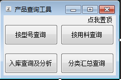

因为开发了一个查询的小工具，满足自己日常工作时查询数据使用，记录开发中遇到的一些问题与解决方法，

主要是`vb.net`控件的一些属性和`SQL`查询语句，毕竟只会一点`vba`，切换到`vb`会简单一些，而且窗体设计更直观。

涉及到`SQL`查询，是因为数据都是存储在服务器的`SQL server`数据库中，数据库由公司使用的Kindee软件创建，直接拿来查询就行了，希望以后能涉及到增删改的操作。

因为一开始需要的功能是根据自己的需要一点点添加的，也没像标准开发流程那样，写功能及实现的流程图，使用的开发工具是`VisualStudio2019`,

- 创建了一个主界面



为的就是把功能分开，这时候类是什么都不懂，所以写了很多重复代码,创建这个窗体还是很简单，在窗体上添加四个按钮`button`和一个标签`label`控件就行,各自的`text`属性及上方出现的文字,四个按钮要实现的功能很简单，点击时弹出相应的查询窗口，标签的功能也是，点击时，使窗口在`置顶显示`和`取消置顶`之间切换。如下代码，使用`.show()`弹出相应窗口。标签的`text`属性搭配`if`语句展示功能，窗体的`.TopMost`属性切换是否置顶
``` vbnet
Public Class Main
    Private Sub Button1_Click(sender As Object, e As EventArgs) Handles Button1.Click
        XHCX.Show()
    End Sub
    Private Sub Button2_Click(sender As Object, e As EventArgs) Handles Button2.Click
        YLCX.Show()
    End Sub
    Private Sub Button3_Click(sender As Object, e As EventArgs) Handles Button3.Click
        CRKCX.Show()
    End Sub
    Private Sub Button4_Click(sender As Object, e As EventArgs) Handles Button4.Click
        FLHZCX.Show()
    End Sub
    Private Sub Label1_Click(sender As Object, e As EventArgs) Handles Label1.Click
        If Label1.Text = "点我置顶" Then
            Me.TopMost = True
            Label1.Text = "点我取消"
        Else
            Me.TopMost = False
            Label1.Text = "点我置顶"
        End If
    End Sub
End Class
```
- 按型号查询


主要是标签`label`和文本框`textbox`控件，再加一个日期`DateTimePicker`控件

```vbnet
Imports System.Data.SqlClient

Public Class XHCX
    Dim query, query1 As String
定义enter键转到button功能
    Private Sub TextBox1_KeyDown(ByVal sender As Object, ByVal e As System.Windows.Forms.KeyEventArgs) Handles TextBox1.KeyDown
        If e.KeyCode = Keys.Enter Then
            Button1_Click(sender, e)
        End If
    End Sub
定义按钮点击的功能
    Private Sub Button1_Click(sender As Object, e As EventArgs) Handles Button1.Click
        'On Error Resume Next
定义一些SQL查询语句
        query1 = "SELECT CONVERT(int,SUM(FWIPQty)) AS ZZhiPin,FItemID AS XHao,FItemName AS YLiao,CONVERT(FLOAT,FQtyScrap) AS DZhong, FWorkName FROM AIS20180425162956.dbo.View_PPBOM_Y02 WHERE  FItemID LIKE '%" & TextBox1.Text & "%'  AND FDate > '" & DateTimePicker1.Value & "' GROUP BY FWorkName,FItemID,FItemName,FQtyScrap ORDER BY FItemID"  '在制品查询
        query = "SELECT CONVERT(int,SUM(FQty)) AS Qty,FMaterialName AS MName,FMaterialParentID AS MPID,FStockID AS FSID FROM AIS20180425162956.dbo.vwStockQuery  GROUP BY FMaterialParentID,FStockID,FMaterialName" '库存查询
        'mySQL3 = "SELECT SUM(FQty) FROM AIS20180425162956.dbo.vwStockQuery WHERE FMaterialNumber LIKE '%" & itnum & "%' AND FMaterialParentID = '2397' AND FStockID = '302'"   '半成品查询
        'mySQL4 = "SELECT SUM(FQty) FROM AIS20180425162956.dbo.vwStockQuery WHERE FMaterialNumber LIKE '%" & itnum & "%' AND FMaterialParentID = '1092' AND FStockID = '303'"   '成品查询
        'mySQL7 = " SELECT FQty FROM AIS20180425162956.dbo.vwStockQuery WHERE FMaterialName LIKE '%" & ittext6 & "%'  AND FStockName = '原材料库'"   '原材料库存查询

使用linq查询table，其实我觉得还不如直接写SQL语句
        Dim dt1 As DataTable = GetData(query1)
        Dim dt As DataTable = GetData(query)
        Dim x = (From p In dt1.AsEnumerable() Where p.Field(Of String)("FWorkName") = "精加工车间" Order By p.Field(Of String)("XHao") Select p.Field(Of Integer)("ZZhiPin")).ToArray()
        Dim y = (From p In dt1.AsEnumerable() Where p.Field(Of String)("FWorkName") = "表面处理车间" Order By p.Field(Of String)("XHao") Select p.Field(Of Integer)("ZZhiPin")).ToArray()
        Dim z = (From p In dt1.AsEnumerable() Where p.Field(Of String)("FWorkName") = "锻打车间" Order By p.Field(Of String)("XHao") Select p.Field(Of String)("YLiao")).ToArray() '产品用料
        Dim u = (From p In dt1.AsEnumerable() Where p.Field(Of String)("FWorkName") = "锻打车间" Order By p.Field(Of String)("XHao") Select p.Field(Of Double)("DZhong")).ToArray() '单只重量
        Dim m = "*" + TextBox1.Text + "*"
        TextBox5.Text = x(0)
        TextBox3.Text = y(0)
        TextBox7.Text = z(0)
        TextBox9.Text = u(0)

        Dim a = (From v In dt.AsEnumerable() Where v.Field(Of Integer)("FSID") = "302" And v.Field(Of Integer)("MPID") = "612" And v.Field(Of String)("MName") Like m Select v.Field(Of Integer)("Qty")).ToArray() '毛坯库存
        Dim b = (From v In dt.AsEnumerable() Where v.Field(Of Integer)("FSID") = "302" And v.Field(Of Integer)("MPID") = "2397" And v.Field(Of String)("MName") Like m Select v.Field(Of Integer)("Qty")).ToArray() '半成品库存
        Dim c = (From v In dt.AsEnumerable() Where v.Field(Of Integer)("FSID") = "303" And v.Field(Of Integer)("MPID") = "1092" And v.Field(Of String)("MName") Like m Order By v.Field(Of Integer)("Qty") Descending Select v.Field(Of Integer)("Qty")).ToArray() '成品库存
        Dim d = (From v In dt.AsEnumerable() Where v.Field(Of String)("MName") = TextBox7.Text Select v.Field(Of Integer)("Qty")).ToArray() '原材料库存

        TextBox4.Text = a(0)
        TextBox6.Text = b(0)
        TextBox2.Text = c(0)
        TextBox8.Text = d(0)  '原材料库存
        If TextBox7.Text = "" Then
            MsgBox("未查到此型号，型号可能有误，请用K3确认")
        End If
        TextBox1.SelectAll()
    End Sub

    Private Sub Button2_Click(sender As Object, e As EventArgs) Handles Button2.Click
        'GJCX.Show()
    End Sub
同样置顶与取消置顶
    Private Sub Label12_Click(sender As Object, e As EventArgs) Handles Label12.Click
        If Label12.Text = "点我置顶" Then
            Me.TopMost = True
            Label12.Text = "点我取消"
        Else
            Me.TopMost = False
            Label12.Text = "点我置顶"
        End If
    End Sub

    两个查询用的function
    Private Shared Function GetData(ByVal query As String) As DataTable
        Dim constr As String = "Data Source=192.168.10.23;Initial Catalog=AIS20180425162956;Persist Security Info=false;User ID=sa;Password=a.0"
        Using con As SqlConnection = New SqlConnection(constr)
            Using sda As SqlDataAdapter = New SqlDataAdapter(query, con)
                Dim dt As DataTable = New DataTable()
                sda.Fill(dt)
                Return dt
            End Using
        End Using
    End Function
    Private Shared Function GetDa(ByVal query1 As String) As DataTable
        Dim constr As String = "Data Source=192.168.10.23;Initial Catalog=AIS20180425162956;Persist Security Info=false;User ID=sa;Password=a.0"
        Using con As SqlConnection = New SqlConnection(constr)
            Using sda1 As SqlDataAdapter = New SqlDataAdapter(query1, con)
                Dim dt1 As DataTable = New DataTable()
                sda1.Fill(dt1)
                Return dt1
            End Using
        End Using
    End Function
End Class
```
- 用料查询界面


主要使用`DataGridView`绑定查询到的数据表，并在查询按钮点击后增加一列用于计算
计算一列的和，使用`sum+=`

```vbnet
Imports System.Data.SqlClient
Public Class YLCX
    Private Sub Button1_Click(sender As Object, e As EventArgs) Handles Button1.Click
        On Error Resume Next
        Dim cn As SqlConnection
        Dim da1, da2 As SqlDataAdapter
        Dim ds1, ds2 As DataSet
        Dim mysql1, mysql2 As String
        Dim ittext
        Dim cnStr As String = "Data Source=192.168.10.23;Initial Catalog=AIS20180425162956;Persist Security Info=false;User ID=sa;Password=a.0;"
        mysql1 = " SELECT FName  AS '产品型号', convert(float,FChildQty) AS '单只重量' FROM AIS20180425162956.dbo.vICBOM WHERE  FChildName like '%" & ComboBox1.Text & "φ" & ComboBox2.Text & "%' AND FUseStatus = '使用'"
        mysql2 = " SELECT SUM(FQty) AS FQty FROM AIS20180425162956.dbo.vwStockQuery WHERE FMaterialName LIKE '%" & ComboBox1.Text & "φ" & ComboBox2.Text & "%'  AND FStockName = '原材料库'"   '原材料查询
        cn = New SqlConnection(cnStr) '打开数据库
        da1 = New SqlDataAdapter(mysql1, cn)
        da2 = New SqlDataAdapter(mysql2, cn)
        ds1 = New DataSet()
        ds2 = New DataSet()
        da1.Fill(ds1, mysql1)
        da2.Fill(ds2, mysql2)
        TextBox1.Text = 0.0
        If ds2.Tables IsNot Nothing Then
            DataGridView1.Columns.Clear()   '先清空一下，避免每次查询时都会增加一列
            DataGridView1.DataSource = ds1.Tables(mysql1)
            DataGridView1.Columns(0).AutoSizeMode = DataGridViewAutoSizeColumnMode.AllCells
            DataGridView1.Columns(0).ReadOnly = True
            DataGridView1.Columns(1).ReadOnly = True
            DataGridView1.Columns(2).ReadOnly = False
            DataGridView1.Columns.Add(2, "输入预下单数量")
            ittext = ds2.Tables(mysql2).Rows(0).Item("FQty")
            TextBox1.Text = Math.Round(ittext, 1)               '原材料重量，用math函数和SQL语句中使用convert转换数据类型效果一样
        Else
            TextBox1.Text = 0.0
            DataGridView1.DataSource = ds1.Tables(mysql1)
        End If
    End Sub
    Private Sub Label4_Click(sender As Object, e As EventArgs) Handles Label4.Click
        If Label4.Text = "点我置顶" Then
            Me.TopMost = True
            Label4.Text = "点我取消"
        Else
            Me.TopMost = False
            Label4.Text = "点我置顶"
        End If
    End Sub
    Private Sub DataGridView1_CellEndEdit(sender As Object, e As DataGridViewCellEventArgs) Handles DataGridView1.CellEndEdit
        'Button2_Click(sender, e)
        Dim sum As Integer = 0
        For i As Integer = 0 To DataGridView1.Rows.Count - 1
        '计算新增一列的合计
            sum += (DataGridView1.Rows(i).Cells(1).Value * DataGridView1.Rows(i).Cells(2).Value)
            TextBox2.Text = TextBox1.Text - sum
        Next
    End Sub
End Class
```
- 入库查询分析主要使用`chart`控件绘制折线图

使用`linq`将SQL查询的结果转换为数组`array`


```vbnet
'Imports System.Data
Imports System.Data.SqlClient
'Imports System.Configuration
Imports System.Windows.Forms.DataVisualization.Charting
Imports System.Drawing.Printing

Public Class CRKCX
    Dim query As String
    Private Sub Button3_Click(sender As Object, e As EventArgs) Handles Button3.Click
        If Button3.Text = "每周趋势" Then
            query = "set datefirst 1 SELECT convert(int,SUM(FBaseQty)) AS 'qty' ,FDepartment AS Dept,datepart(week,FDate) AS week  FROM AIS20180425162956.dbo.vwRK WHERE  FDCStockIDNumber = '02' AND FDepartment in ('锻打车间','精加工车间','金工车间')  AND FDate > '" & DateTimePicker1.Value & "' GROUP BY FDepartment,datepart(week,FDate)"  '入库每周
            Button3.Text = "每月趋势"
        ElseIf Button3.Text = "每月趋势" Then
            query = "set datefirst 1 SELECT convert(int,SUM(FBaseQty)) AS 'qty' ,FDepartment AS Dept,datepart(month,FDate) AS week FROM AIS20180425162956.dbo.vwRK WHERE  FDCStockIDNumber = '02' AND FDepartment in ('锻打车间','精加工车间','金工车间')  AND FDate > '" & DateTimePicker1.Value & "' GROUP BY FDepartment,datepart(month,FDate)"  '入库每周
            Button3.Text = "每周趋势"
        End If
        Dim dt As DataTable = GetData(query)

        Dim partments As List(Of String) = (From p In dt.AsEnumerable Select p.Field(Of String)("Dept")).Distinct().ToList()

        Chart1.Series.Clear()

        For Each partment As String In partments
            Dim x As Integer() = (From p In dt.AsEnumerable() Where p.Field(Of String)("Dept") = partment Order By p.Field(Of Integer)("week") Select p.Field(Of Integer)("week")).ToArray()
            Dim y As Integer() = (From p In dt.AsEnumerable() Where p.Field(Of String)("Dept") = partment Order By p.Field(Of Integer)("week") Select p.Field(Of Integer)("qty")).ToArray()
            Chart1.Series.Add(New Series(partment))
            Chart1.Series(partment).IsValueShownAsLabel = True
            Chart1.Series(partment).BorderWidth = 3
            Chart1.Series(partment).ChartType = SeriesChartType.Line
            Chart1.Series(partment).SmartLabelStyle.MaxMovingDistance = 50
            Chart1.Series(partment).Points.DataBindXY(x, y)
            For i As Integer = 0 To Chart1.Series(partment).Points.Count - 1
                Chart1.Series(partment).Points(i).ToolTip = Chart1.Series(partment).Name & Chart1.Series(partment).Points(i).GetValueByName("y")
            Next
        Next
        Chart1.Legends(0).Enabled = True
        Chart1.Legends(0).IsTextAutoFit = True
        Chart1.Legends(0).Docking = Docking.Bottom
    End Sub

    Private Sub CRKCX_Load(sender As Object, e As EventArgs) Handles MyBase.Load

        query = "set datefirst 1 SELECT convert(int,SUM(FBaseQty)) AS 'qty' ,FDepartment AS Dept,datepart(week,FDate) AS week  FROM AIS20180425162956.dbo.vwRK WHERE  FDCStockIDNumber = '02'  AND FDepartment in ('锻打车间','精加工车间','金工车间') AND FDate > '20190101'  GROUP BY FDepartment,datepart(week,FDate)"
        Dim dt As DataTable = GetData(query)
        '部门转换为列表
        Dim partments As List(Of String) = (From p In dt.AsEnumerable() Select p.Field(Of String)("Dept")).Distinct().ToList()
        If Chart1.Series.Count() = 1 Then
            Chart1.Series.Clear()
        End If
        '转换数组
        For Each partment As String In partments
            Dim x As Integer() = (From p In dt.AsEnumerable() Where p.Field(Of String)("Dept") = partment Order By p.Field(Of Integer)("week") Select p.Field(Of Integer)("week")).ToArray()
            Dim y As Integer() = (From p In dt.AsEnumerable() Where p.Field(Of String)("Dept") = partment Order By p.Field(Of Integer)("week") Select p.Field(Of Integer)("qty")).ToArray()
            '设置chart属性，各部门为图例
            Chart1.Series.Add(New Series(partment))
            Chart1.Series(partment).IsValueShownAsLabel = True
            Chart1.Series(partment).BorderWidth = 3
            Chart1.Series(partment).ChartType = SeriesChartType.Line
            Chart1.Series(partment).SmartLabelStyle.MaxMovingDistance = 50
            Chart1.Series(partment).Points.DataBindXY(x, y)
            '设置鼠标移动到坐标点显示数据详情
            For i As Integer = 0 To Chart1.Series(partment).Points.Count - 1
                Chart1.Series(partment).Points(i).ToolTip = Chart1.Series(partment).Name & Chart1.Series(partment).Points(i).GetValueByName("y")
            Next
        Next
        Chart1.Legends(0).Enabled = True
        Chart1.Legends(0).IsTextAutoFit = True
        Chart1.Legends(0).Docking = Docking.Bottom
    End Sub
    'function连接数据库获取数据
    Private Shared Function GetData(ByVal query As String) As DataTable
        Dim constr As String = "Data Source=192.168.10.23;Initial Catalog=AIS20180425162956;Persist Security Info=false;User ID=sa;Password=a.0"
        Using con As SqlConnection = New SqlConnection(constr)
            Using sda As SqlDataAdapter = New SqlDataAdapter(query, con)
                Dim dt As DataTable = New DataTable()
                sda.Fill(dt)
                Return dt
            End Using
        End Using
    End Function

End Class
```
