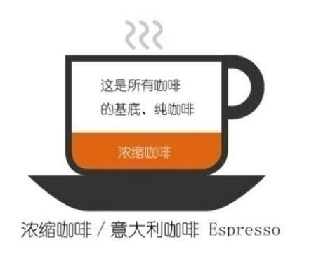
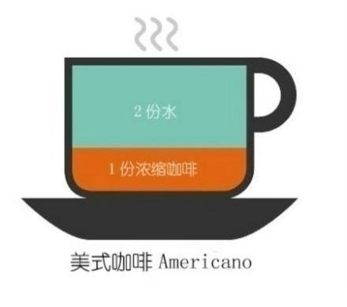
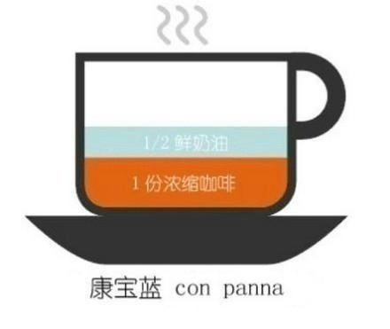
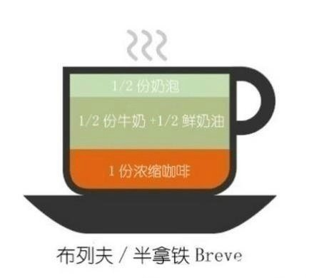
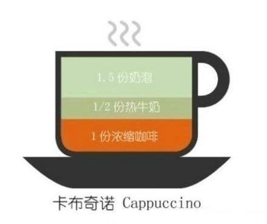
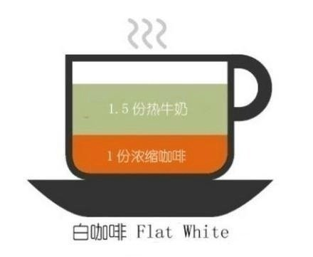
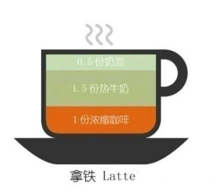
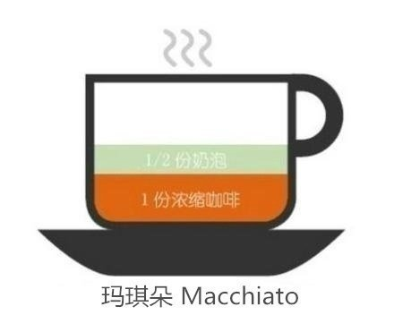
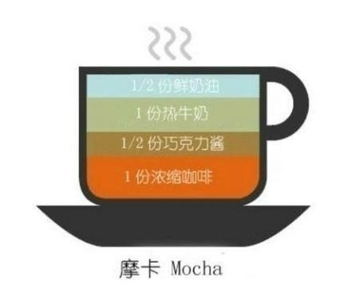

一直想写这个咖啡的简介，可是插入图片太麻烦，今天找到方法，就试一下，顺便把这个写了

- Espresso(其实用这个词更能代表意式咖啡，而不是“意式”、”浓缩”，espresso的浓醇反正我没感受过，浓咖啡真的喝不了，喝了特别困，没错，***特别困***)

- 美式(Americano)，个人只能喝美式，半点奶都不能加，我也不想啊，乳糖不耐让我想哭,一份水不加糖更喜欢,甘醇

- 康宝蓝(Con Panna),1/2份奶油，也许我应该试试，毕竟吃过很多奶油蛋糕

- Breve，Cappuccino，Flat White，Latte，Macchiato，Mocha，these are combined with milk，they are all the same。

